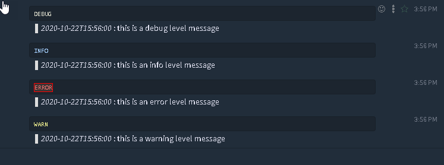

zuliprus
========

Zulip hook for [Logrus](https://github.com/sirupsen/logrus). 

### Example output



## Use

```go
package main

import (
	"os"

	logrus "github.com/sirupsen/logrus"
	"github.com/tiger5226/zuliprus"
)

func main() {

	logrus.SetFormatter(&logrus.JSONFormatter{})

	logrus.SetOutput(os.Stderr)

	logrus.SetLevel(logrus.DebugLevel)

	logrus.AddHook(&zuliprus.ZuliprusHook{
		APIURL:         "https://zulip.mycompany.com/api/v1/",
		APIKey:         "aP8vzq5gwfZHBd4V6ztcYzO4Jugczgt6",
		Email:          "my-bot@zulip.mycompany.com",
		AcceptedLevels: zuliprus.LevelThreshold(logrus.DebugLevel),
		Stream:         "mystream",
		Topic:          "that-topic",
	})

	logrus.Debug("this is a debug level message")
	logrus.Info("this is an info level message")
	logrus.Error("this is an error level message")
	logrus.Warning("this is a warning level message")

}

```

## Parameters

#### Required
  * APIURL
  * APIKey
  * Email
  * Stream
  
#### Optional
  * AcceptedLevels
  * UserEmails
  * Topic
  * Asynchronous
  * Disabled
  * FormatFn
## Installation

    go get github.com/tiger5226/zuliprus
    
## FormatFn

This can be changed to your liking by setting your own function. It controls the message
output sent to zulip for an individual entry

```go
var MsgFmtFn = func(e *logrus.Entry) string {
	return fmt.Sprintf("%s>  *%s*  : %s", LevelPrefixFn(e), e.Time.Format("2006-01-02T15:04:05"), e.Message)
}
```

## LevelPrefixFn

This controls how we color the output to zulip which uses Zenburn style in dark mode. If you are 
in light mode, this possible won't look like the same. So this is an entry point for you to set your own.

```go
var LevelPrefixFn = func(e *logrus.Entry) string {
	color := ""
	switch e.Level {
	case logrus.DebugLevel:
		color = "```c++\nDEBUG\n```\n"
	case logrus.InfoLevel:
		color = "```bash\nINFO\n```\n"
	case logrus.ErrorLevel, logrus.FatalLevel, logrus.PanicLevel:
		color = "```terraform\nERROR\n```\n"
	default:
		color = "```apacheconf\nWARN\n```\n"
	}

	return color
}
```

## Credits

Based on slackrus hook by [johntdyer](https://github.com/johntdyer/zuliprus)
